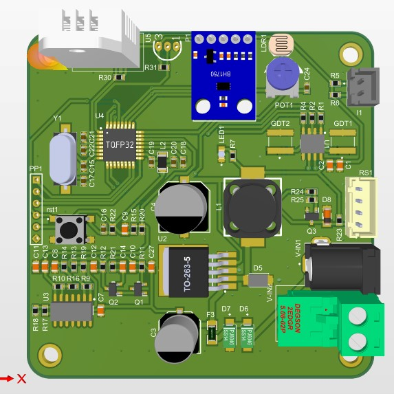
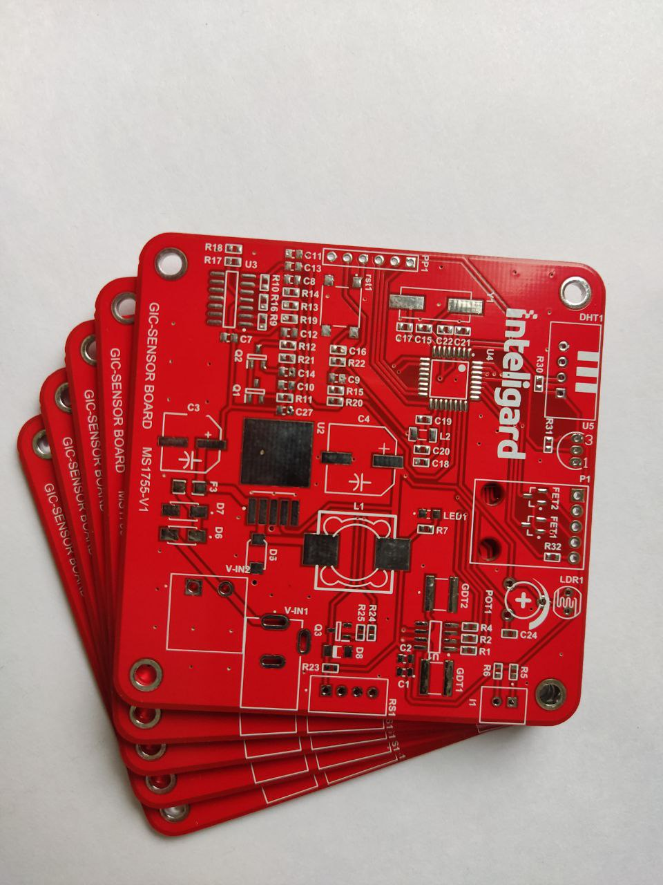

# Sensors Panel
On this board, there are 4 sensor modules.
- BH1750 ambient light sensor communicates over I2C
- RTD photocell sensor
- DS18B20 digital room temperature sensor
- DHT22 humidity and temperature sensor

An Atmega328 gathers all the sensor information and sends it to the master board over the RS485 bus.

